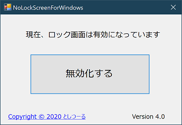

# NoLockScreen 11

## これは何？

* Windows8.1, 10, 11のロック画面を無効化(または有効化)するソフトウェアです。

## 動作環境

* Windows 8.1, 10, 11

## ダウンロード

* GitHubの [Releases](https://github.com/nakkaa/NoLockScreenForWindows/releases) からダウンロードできます。
　
## 使い方
　
1. NLSforWin.exeをダブルクリックします。
2. ユーザーアカウント制御ダイアログが表示されるので、「はい」をクリックします。
3. 「無効化する」ボタンをクリックします。
4. これで、ロック画面とさよなら(無効化)しました。
5. もう一度同じ手順をふむと、ロック画面を有効化できます。

## 免責

* このソフトウェアを使用したことによって生じたすべての損害・不具合等に関しては、
著作権者は一切の責任を負いません。各自の責任においてご使用ください。

## 連絡先

* メール: tnakkaa★gmail.com (★は@へ変更してください)
* Webサイト: https://7ka.org/software/nolockscreen8/
